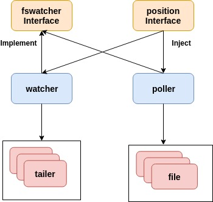

grok_exporter mod
=============

修改原始 [grok_exporter](https://github.com/fstab/grok_exporter)，支持软链接、日志偏移记录。

## 使用

```shell
# 先下载用到的pattern文件
git submodule update --init --recursive

# 运行
go run grok_exporter.go -config config.yml
```

```yaml
global:
    config_version: 2
    # 日志级别：panic, fatal, error, warn, info, debug, trace
    log_level: debug
input:
    type: file
    
     # 可使用环境变量指定 GROK_INPUT_FILE
    path: ./dir/*.log
        
    # 偏移文件,可使用环境变量指定 GROK_INPUT_POSITION
    position_file: ./position.json
    
    # 偏移文件同步周期
    position_sync_interval: 5s
    
    # 指定poll_interval_seconds后会采用轮询方式读日志
    #poll_interval_seconds: 3
    
    # DO NOT USE THIS，长度超过max_line_size会被分为多行，分为多行后，不满足匹配格式
    #max_line_size: 128
    
    # DO NOT USE THIS，每个文件 每秒 最多读多少行，hpcloud/tail在达到速率限制后，冷却1s完，不会自动去读余下内容
    #max_lines_rate_per_file: 128
grok:
    patterns_dir: ./logstash-patterns-core/patterns
    additional_patterns:
    - 'EXIM_MESSAGE [a-zA-Z ]*'
metrics:
    - type: counter
      name: exim_rejected_rcpt_total
      help: Total number of rejected recipients, partitioned by error message.
      match: '%{EXIM_DATE} %{EXIM_REMOTE_HOST} F=<%{EMAILADDRESS}> rejected RCPT <%{EMAILADDRESS}>: %{EXIM_MESSAGE:message}'
      labels:
          error_message: '{{.message}}'
server:
    host: localhost
    port: 8989

```

```
# 偏移文件以json保存日志文件的文件系统号-inode编号和偏移量
{
    "10302-642271": 941183,
    "10302-64227b": 627455
}
```

## 实现



删除tailer/fswatcher中原有内容，只保留对外interface，该接口对外暴漏两个chan，发送日志行的Lines 和 发送Error的errors

watcher、poller实现fswatcher.Interface，提供以fsnotify和轮询两种形式的日志抓取方式

初始化watcher、poller时注入position.Interface，其本质是一个 map[inode_number]offset，其内容会周期性同步到磁盘

watcher使用 [fsnotify](https://github.com/fsnotify/fsnotify) 监听文件夹、[hpcloud/tail](https://github.com/hpcloud/tail) 监听文件，文件有变化时，tailer将新内容发送到Lines

poller周期性list文件夹，对每个匹配的日志文件开一个goroutine (file)读取日志行，并发送到Lines

tailer和file实现均使用 [Fan-In](https://github.com/tmrts/go-patterns/blob/master/messaging/fan_in.md) 模式